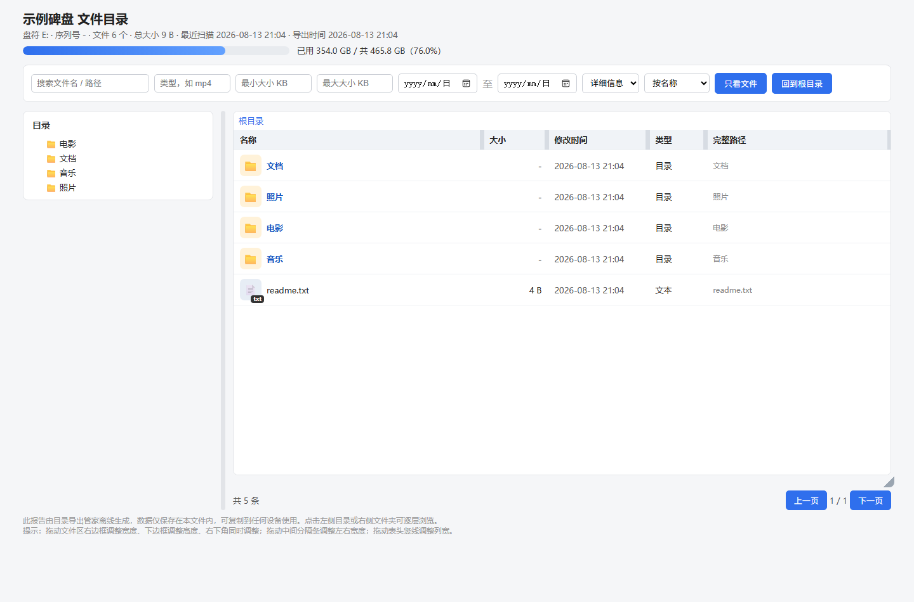

# CatalogExporter · 目录导出管家（v1.3）

> 插盘自动扫描 · 拔盘离线浏览 · 一键导出 HTML 目录报告

CatalogExporter 是一款面向普通用户的 Windows 便携软件：插入外接硬盘后自动扫描并记录完整文件目录，拔下硬盘后依然可以像“查目录”一样浏览、搜索、筛选硬盘里的文件，并随时导出一份自带搜索、排序和目录树的 HTML 离线报告。

v1.3 使用 **PySide6（Qt for Python）** 重构了界面与托盘层，业务逻辑（扫描、索引、导出、自动导出、开机自启）与 v1.2 完全一致。

---

## 界面预览

导出的 HTML 目录报告（演示数据）：



---

## 功能特性

- **插盘全自动扫描**：后台常驻托盘（QSystemTrayIcon），检测到硬盘插入后立即自动扫描，无需打开软件、无需点击任何按钮
- **稳定硬盘识别**：使用卷 GUID / 卷序列号区分硬盘，不依赖盘符；多块硬盘索引互不混淆
- **增量与续扫**：再次插入同一块硬盘自动更新；扫描中拔盘安全中止，下次插入自动续扫
- **拔盘离线浏览**：左侧硬盘卡片 + 懒加载目录树，右侧文件列表（QTableView + 排序/过滤代理模型），支持搜索、排序、类型/大小/日期筛选
- **浅色/深色主题**：QSS 统一配色，一键切换，设置中可保存默认主题
- **HTML 离线报告**：单文件、无需联网，自带目录树、查看方式切换（详细信息/列表/内容/平铺/大小图标）、列宽与区域拖拽调整
- **自动导出**：可设置开机自动导出、插盘扫描完成后自动导出，按“盘符盘_usb_序列号”分文件夹保存
- **容量可视化**：报告顶部显示总容量、已用空间与图形化进度条
- **隐私安全**：索引仅保存在本机，只读扫描，不上传任何数据
- **命令行支持**：`list` / `scan` / `export` / `delete` / `clear` / `install` / `uninstall`（与 v1.2 完全一致）

---

## 快速开始

### 源码运行

环境要求：Windows 10/11，Python 3.10+（安装时勾选 Add Python to PATH）。

```bat
python -m pip install -r requirements-build.txt   :: 安装 PySide6 与 PyInstaller
python main.py gui                                :: 打开图形界面
python main.py tray                               :: 启动后台托盘服务
python main.py install                            :: 设置开机自启
```

只安装 PySide6-Essentials（体积更小）也可运行源码版：

```bat
python -m pip install PySide6-Essentials
```

### 便携版

直接下载 Release 中的 `CatalogExporter_便携版.zip`，解压后双击 `CatalogExporter\CatalogExporter.exe` 即可运行，无需安装 Python。

---

## 命令行示例

```bat
python main.py list
python main.py scan --disk <disk_id> --full
python main.py export --disk <disk_id> --out D:\report.html
python main.py delete --disk <disk_id>
python main.py clear
```

`list` 会输出硬盘 ID（卷 GUID）、盘符、序列号、状态、文件数与总大小。

---

## 自动导出规则

在“设置 → 自动导出 HTML 报告”中可配置：

- 开机时自动导出所有已索引硬盘的报告
- 插入硬盘并扫描完成后自动导出该硬盘的报告
- 导出目录按“盘符盘_usb_序列号”分子文件夹保存

例如：

```text
导出目录/
├── c盘_6eb6916a/
│   └── C盘_6eb6916a_20260813_180000.html
├── i盘_usb_6e42646d/
│   └── I盘_usb_6e42646d_20260813_180000.html
```

USB 识别基于 Windows 物理磁盘 `BusType`，不会把 M.2/NVMe 误判为 USB。

---

## v1.3 项目结构

```text
CatalogExporter/
├── main.py                  # 命令行 / 启动入口（未改动）
├── run_gui.pyw              # 图形界面入口（未改动）
├── run_tray.pyw             # 托盘后台入口（未改动）
├── diskmenu/
│   ├── db.py                # SQLite 数据层（原样保留）
│   ├── scanner.py           # 只读扫描器（原样保留）
│   ├── volumes.py           # Windows 卷枚举与 USB 识别（原样保留）
│   ├── service.py           # 后台服务与自动导出（原样保留）
│   ├── exporter.py          # HTML 离线报告生成（原样保留）
│   ├── cli.py               # 命令行工具（原样保留）
│   ├── autostart.py         # 开机自启（原样保留）
│   ├── single_instance.py   # 单实例（原样保留）
│   ├── paths.py / util.py   # 路径与工具（原样保留）
│   ├── entry.py             # 进程入口（小改：接入 Qt 事件循环与通知）
│   ├── gui.py               # 【重写】PySide6 主窗口
│   ├── tray.py              # 【重写】QSystemTrayIcon 托盘
│   ├── qt_theme.py          # 【新增】浅色/深色 QSS 主题与图标
│   ├── qt_models.py         # 【新增】文件表格模型 + 排序/过滤代理
│   ├── qt_widgets.py        # 【新增】硬盘卡片 + 懒加载目录树
│   └── settings_dialog.py   # 【新增】设置对话框
├── assets/icons/            # 【新增】SVG 图标
├── tests/                   # 自动化测试（核心 + Qt 界面）
├── 重新打包_v1.3.bat        # PyInstaller 打包脚本
└── 启动_v1.3_源码版.bat     # 源码启动诊断脚本
```

---

## 构建与测试

```bat
:: 运行测试（核心 + Qt 界面，界面测试使用 offscreen 平台，无需显示器）
python -m unittest discover -s tests -v

:: 打包便携版（需安装 PyInstaller 与 PySide6）
python -m pip install -r requirements-build.txt
重新打包_v1.3.bat
```

打包产物位于 `dist\CatalogExporter\`。

### 体积变化说明

v1.2（tkinter）便携版约 **14 MB**（zip）。v1.3 引入 Qt 运行时，打包体积会明显增大，预计：

- 解压后 `dist\CatalogExporter\` 约 **80–130 MB**（含 Qt 平台插件、SVG 插件等）
- 压缩后的便携版 zip 约 **40–60 MB**

具体体积以实际打包结果为准（见 Release 产物）。

---

## 迁移说明（v1.2 → v1.3）

- **被替换的 Tkinter 代码**：`diskmenu/gui.py`（tkinter 主窗口、ttk 控件、圆角按钮）整体重写为 PySide6（QMainWindow / QTableView / QTreeWidget / QListWidget / QSS）。
- **被替换的 ctypes 托盘代码**：`diskmenu/tray.py` 的 Win32 托盘消息循环重写为 `QSystemTrayIcon`；仅保留 `WM_DEVICECHANGE` 设备事件监听（QAbstractNativeEventFilter + 隐藏窗口）。
- **原样保留的业务代码**：`db.py`、`scanner.py`、`volumes.py`、`service.py`、`exporter.py`、`cli.py`、`autostart.py`、`single_instance.py`、`paths.py`、`util.py` 均未改动；`main.py` 命令行行为不变。
- **行为等价性**：搜索/排序/类型/大小/日期筛选、完整重扫、删除/清空索引、导出 HTML、设置自动导出与开机自启、托盘菜单（打开主界面/开始或停止扫描/导出报告/退出）均已保留。

---

## 隐私说明

- 软件只记录文件目录信息（路径、名称、大小、修改时间），不读取文件内容
- 索引数据库保存在本机 `%APPDATA%\DiskMenu\index.db`
- 导出的 HTML 报告同样只包含目录信息，可放心拷贝、发送

---

## 开源协议

本项目基于 [MIT License](LICENSE) 开源，欢迎使用、修改和二次开发。

> 本项目由 AI 编程助手（Codex）辅助开发。
